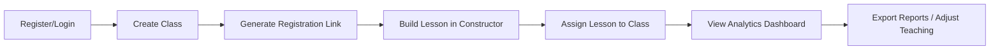
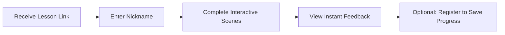
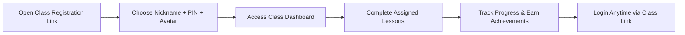

# ARCFlow - Project Specification Document

**Version:** 1.0  
**Date:** May 2026  
**Status:** Ready for Development Planning  
**Target Stack:** PHP, Laravel, Livewire, Tailwind CSS, MySQL, Nginx  
**Project Management:** GSD (Get Shit Done) for Opencode  

---

## 1. Executive Summary

### 1.1 Project Vision
**ARCFlow** is an interactive educational web platform that empowers teachers to create, customize, and distribute engaging micro-lessons for school students. The platform combines a flexible lesson builder, AI-assisted content generation, rich interactive elements (quizzes, games, audio responses), and deep analytics—all while maintaining student privacy through a hybrid guest/registered access model.

### 1.2 Core Value Proposition
| Stakeholder | Value |
|-------------|-------|
| **Teachers** | Create interactive lessons without coding; manage virtual classes; receive granular analytics on student performance |
| **Students** | Access lessons instantly via link or class code; minimal registration friction; engaging, gamified learning experience |
| **System** | Unified JSON-based lesson structure enabling extensibility; scalable analytics; multilingual support out-of-the-box |

### 1.3 Key Differentiators
- ✅ **Hybrid Access Model**: Students can participate as guests (no registration) or register via teacher-invited class links for persistent progress tracking
- ✅ **Rich Interactive Scenes**: Beyond multiple-choice—categorization, matching, open-text, audio responses, and extensible game API
- ✅ **Branching Logic**: Adaptive lesson flows based on student responses (`branching` rules in scene definitions)
- ✅ **Multilingual by Design**: Lessons can be created and translated into any language; student interface adapts automatically
- ✅ **Privacy-First**: No PII collection for students; teacher-managed accounts; COPPA/GDPR-K ready architecture

---

## 2. Core Features & Functionality

### 2.1 Lesson Builder (Teacher-Facing)
- **Visual Drag-and-Drop Editor**: Assemble lessons from predefined scene types
- **Scene Types Supported**:
  - `content`: Rich text/HTML content
  - `video`: Embedded video (YouTube, Vimeo, self-hosted)
  - `multiple-choice-quiz`: Single/multi-select with optional confidence rating
  - `categorize-items`: Drag items into categories
  - `match-pairs`: Connect related concepts
  - `open-text-question`: Free-form answer with keyword analysis
  - `audio-response`: Record voice answers via microphone
  - `custom-interactive`: Extensible iframe/API bridge for 2D/3D games
- **AI Assistant**: Generate lesson drafts from topic prompts using LLM integration
- **Versioning**: Auto-save versions; publish/unpublish control
- **Multilingual Support**: Add translations for any scene; set default language

### 2.2 Lesson Player (Student-Facing)
- **Instant Access**: Enter via lesson link or class code + nickname
- **Seamless Navigation**: Progress through scenes with smooth transitions
- **Interactive Elements**: Full support for all scene types with real-time feedback
- **Progress Persistence**: LocalStorage + session token for guests; cloud sync for registered users
- **Branching Logic**: Dynamic scene routing based on `branching.rules` in lesson definition
- **Accessibility**: Keyboard navigation, screen reader support, RTL language support

### 2.3 Class Management (Teacher-Facing)
- **Create Virtual Classes**: Generate unique `classCode` and registration links
- **Student Management**: View enrolled students; reset passwords; deactivate accounts
- **Lesson Assignment**: Assign lessons to entire class, groups, or individuals
- **Registration Flow**: Students register via class link with nickname + PIN (no email required)

### 2.4 Analytics & Reporting
- **Real-Time Dashboard**: View class/lesson completion rates, average scores, time-on-task
- **Scene-Level Insights**: Identify difficult scenes via error rates and time spent
- **Confidence vs. Correctness Analysis**: Detect misconceptions (high confidence + wrong answer)
- **Keyword Analysis**: For open-text responses, track frequency of suggested keywords
- **Longitudinal Tracking**: For registered students, track progress across multiple lessons
- **Export**: CSV/PDF reports for administrative use

### 2.5 Gamification & Engagement (Registered Students)
- **Avatar System**: Choose from curated avatar library; unlock via achievements
- **Achievements**: Earn badges for milestones (first lesson, perfect score, etc.)
- **Progress Visualization**: Personal dashboard with completion stats
- **Theme Customization**: Optional UI themes (space, nature, minimal, etc.)

---

## 3. Data Architecture

### 3.1 Core Entities (Based on IDEAS.md + Extensions)

#### Lesson (Metadata)
```json
{
  "lessonId": "unique-lesson-id-123",
  "version": 1.1,
  "title": "Introduction to the Solar System",
  "description": "A fun and interactive journey...",
  "subject": "Science",
  "gradeLevel": "2-4",
  "author": "Dr. Astro",
  "coverImage": "https://...",
  "isPublished": true,
  "defaultLanguage": "en"
}
```

#### Scene Definition (Inside `lesson_translations.scenes` JSON)
```json
{
  "sceneId": "scene-03-quiz-mercury",
  "sceneType": "multiple-choice-quiz",
  "content": "<p>Time for a quick question!</p>",
  "interactiveElement": {
    "question": "Which planet is closest to the Sun?",
    "options": [...],
    "correctOptionId": "c",
    "enableConfidenceRating": true
  },
  "branching": {
    "onComplete": "scene-04-next",
    "rules": [
      { "condition": "isCorrect == false", "goto": "scene-03-help" }
    ]
  }
}
```

#### Lesson Result (Based on IDEAS.md + Extensions)
```json
{
  "resultId": "unique-result-id-abc987",
  "lessonId": "unique-lesson-id-123",
  "lessonVersion": 1.1,
  "studentInfo": {
    "studentId": "student-xyz", // null for guests
    "classId": "class-abc",
    "nickname": "SuperNova",
    "avatarId": "avatar_05",
    "isGuest": false
  },
  "startTime": "2024-05-20T09:00:15Z",
  "completionTime": "2024-05-20T09:15:30Z",
  "durationInSeconds": 915,
  "score": { "achieved": 3, "possible": 4, "percentage": 75.0 },
  "summary": { "status": "Completed", "feedback": "Great work!" },
  "sceneResponses": [
    {
      "sceneId": "scene-03-quiz-mercury",
      "response": "c",
      "isCorrect": true,
      "confidence": 5,
      "timeSpentSeconds": 25
    }
    // ... additional responses
  ],
  "languageCode": "en"
}
```

### 3.2 Database Schema Overview (MySQL)

| Table | Purpose | Key Fields |
|-------|---------|-----------|
| `users` | Teacher/admin accounts | id, email, password_hash, role |
| `class_groups` | Virtual classes | id, teacher_id, class_code, registration_link, settings(JSON) |
| `students` | Registered student accounts | id, class_id, nickname, password_hash, avatar_id, is_guest |
| `lessons` | Lesson metadata | id, teacher_id, subject, grade_level, is_published |
| `lesson_translations` | Multilingual lesson content | id, lesson_id, language_code, scenes(JSON), is_default |
| `lesson_results` | Student submission data | id, lesson_id, student_id, class_id, scene_responses(JSON), score(JSON) |
| `student_progress` | Longitudinal tracking | id, student_id, lessons_completed, total_score, achievements(JSON) |
| `achievements` | Gamification definitions | id, name, description, icon, criteria(JSON) |
| `languages` | Supported locales | code, name, native_name, direction |

### 3.3 Key Relationships
```
users (1) ──< class_groups (1) ──< students (1) ──< lesson_results
                      │
                      └──< lessons (1) ──< lesson_translations (N)
                                      │
                                      └──< lesson_results
```

---

## 4. User Roles & Flows

### 4.1 Teacher Journey


### 4.2 Student Journey (Guest)


### 4.3 Student Journey (Registered)


---

## 5. Technical Architecture (High-Level)

### 5.1 Backend (Laravel)
- **Authentication**: Laravel Sanctum for API tokens; custom guard for student PIN auth
- **API Layer**: RESTful endpoints for lesson player, analytics, class management
- **Job Queue**: Redis-backed queues for AI generation, audio processing, analytics aggregation
- **File Storage**: S3-compatible storage for audio responses and media assets (signed URLs)
- **Localization**: Laravel's native localization + dynamic language switching per lesson

### 5.2 Frontend (Livewire + Alpine.js + Tailwind)
- **Teacher Dashboard**: Livewire components for reactive UI (lesson builder, analytics)
- **Lesson Player**: Alpine.js/Vue.js SPA embedded in Blade for smooth scene transitions
- **Responsive Design**: Tailwind CSS with mobile-first approach
- **Accessibility**: ARIA labels, keyboard navigation, reduced-motion preferences

### 5.3 External Integrations
- **AI Provider**: OpenAI/Anthropic API for lesson generation (configurable via env)
- **Video Hosting**: YouTube/Vimeo embeds; self-hosted via Laravel Media Library
- **Game Bridge**: `postMessage` API for iframe-embedded interactive content
- **Analytics**: Optional Plausible/Matomo for usage metrics (opt-in)

### 5.4 Security & Compliance
- **Student Privacy**: Zero PII collection; teacher-managed accounts only
- **Data Retention**: Configurable auto-archive for inactive classes/students
- **Content Security**: CSP headers, sanitized HTML in lessons, audio URL signing
- **Regulatory Flags**: Database fields for COPPA/GDPR-K/152-ФЗ compliance tracking

---

## 6. Development Roadmap (GSD-Ready Epics)

### Epic 1: Foundation & Authentication
```gsd
[ ] Setup Laravel project with Livewire + Tailwind
[ ] Implement teacher authentication (register/login/forgot password)
[ ] Create database migrations for core tables (users, lessons, class_groups)
[ ] Setup localization scaffolding (languages table, middleware)
[ ] Configure S3 storage for media assets
```

### Epic 2: Class Management MVP
```gsd
[ ] CRUD for class_groups (create, read, update, deactivate)
[ ] Generate unique class_code and registration_link
[ ] Student registration flow (nickname + PIN + avatar selection)
[ ] Student login via class link
[ ] Teacher view: list students in class
```

### Epic 3: Lesson Builder (Core)
```gsd
[ ] Lesson metadata form (title, subject, grade, cover image)
[ ] Scene editor: drag-and-drop interface (Livewire)
[ ] Implement scene types: content, video, multiple-choice-quiz
[ ] JSON validation & storage in lesson_translations
[ ] Lesson preview mode (teacher view)
```

### Epic 4: Lesson Player (Guest Flow)
```gsd
[ ] Public route for lesson access via token/link
[ ] Scene renderer component (dynamic based on sceneType)
[ ] Implement quiz, categorize, match interactions (Alpine.js)
[ ] Progress persistence via LocalStorage + session token
[ ] Submit lesson_results endpoint (anonymous)
```

### Epic 5: Analytics & Reporting
```gsd
[ ] Teacher dashboard: class/lesson completion stats
[ ] Scene-level analytics: error rates, time spent
[ ] Export lesson_results to CSV
[ ] Implement confidence vs. correctness visualization
[ ] Keyword frequency analysis for open-text responses
```

### Epic 6: Advanced Features
```gsd
[ ] Add branching logic support in lesson player
[ ] Implement audio-response scene (microphone API + storage)
[ ] AI lesson generator endpoint (LLM integration)
[ ] Gamification: achievements system + student progress tracking
[ ] Multilingual lesson creation & translation workflow
```

### Epic 7: Polish & Compliance
```gsd
[ ] Accessibility audit & fixes (WCAG 2.1 AA)
[ ] Implement data retention policies (auto-archive)
[ ] Add privacy notices & consent flows
[ ] Performance optimization (caching, query optimization)
[ ] End-to-end testing (Pest + Laravel Dusk)
```

---

## 7. Key Technical Decisions & Constraints

### 7.1 Data Storage Strategy
- **JSON Fields**: Use MySQL `JSON` type for `scenes` and `scene_responses` to maintain flexibility from IDEAS.md
- **Virtual Columns**: Create indexed virtual columns for frequent JSON queries (e.g., `score_percentage`)
- **Versioning**: Store lesson content in `lesson_translations` with `lesson_version` to preserve historical results

### 7.2 Multilingual Implementation
- **Content Separation**: Each language is a separate row in `lesson_translations` (not nested JSON)
- **Fallback Logic**: If translation missing, fall back to `is_default = true` language
- **UI Localization**: Laravel's `__()` helper + dynamic locale switching per student preference

### 7.3 Hybrid Access Model
- **Guests**: Identified by `session_token` + `nickname`; results stored with `is_guest = true`
- **Registered**: Linked to `students.id`; progress aggregated in `student_progress`
- **Migration Path**: Endpoint to convert guest session → registered account (preserve results)

### 7.4 Extensibility for Games/Interactives
- **Scene Type Registry**: PHP interface `InteractiveScene` for registering new scene types
- **Game Bridge Standard**: `postMessage` contract for iframe embeds:
  ```js
  // Game → Platform
  window.parent.postMessage({
    type: 'ARCFLOW_COMPLETE',
    sceneId: 'scene-xyz',
    data: { score: 100, metadata: {...} }
  }, 'https://arcflow.app');
  ```

---

## 8. Success Metrics & KPIs

| Metric | Target | Measurement |
|--------|--------|-------------|
| Teacher Onboarding Time | < 5 minutes to first lesson | Analytics event tracking |
| Lesson Completion Rate (Students) | > 85% | `lesson_results` aggregation |
| Guest → Registered Conversion | > 30% | Funnel analysis |
| Scene Error Detection | Identify top 3 difficult scenes per lesson | Analytics query accuracy |
| Multilingual Adoption | Support 5+ languages in Year 1 | `languages` table usage |
| System Uptime | 99.5% | Monitoring (Laravel Telescope + external) |

---

## 9. Risks & Mitigations

| Risk | Impact | Mitigation |
|------|--------|------------|
| Student privacy regulations | High | Design with privacy-by-default; consult legal early; implement data export/delete |
| Complex JSON queries slowing analytics | Medium | Use virtual columns + materialized views for heavy reports |
| Game API fragmentation | Medium | Define strict `custom-interactive` contract; provide reference implementation |
| Teacher adoption friction | High | Invest in intuitive builder UI; provide templates; offer onboarding tutorials |
| Audio storage costs | Low-Medium | Compress audio client-side; implement retention policies; offer opt-out |

---

## 10. Getting Started Checklist (For GSD Import)

```gsd
[ ] Clone repository & setup local environment (Laravel Sail recommended)
[ ] Run migrations & seed languages table
[ ] Configure .env: APP_URL, DB credentials, S3 keys, AI provider keys
[ ] Install frontend dependencies: npm install && npm run dev
[ ] Create first teacher account via artisan command or registration
[ ] Test guest lesson flow with sample lesson from IDEAS.md
[ ] Import this spec into GSD as project documentation
[ ] Begin Epic 1 tasks in GSD board
```

---

## Appendix A: Sample Lesson JSON (From IDEAS.md)
*See attached `IDEAS.md` for complete `Lesson` and `LessonResult` examples.*

## Appendix B: API Endpoint Sketch
```
GET  /api/classes/{code}                    # Get class info for registration
POST /api/students/register                 # Register student to class
POST /api/students/login                    # Login student (nickname + PIN)
GET  /api/lessons/{token}                   # Get lesson content (guest/registered)
POST /api/lessons/{id}/complete             # Submit lesson_results
GET  /api/teachers/analytics/class/{id}     # Get class analytics
POST /api/teachers/lessons/generate         # AI-assisted lesson generation
```

## Appendix C: Scene Type Reference
| sceneType | interactiveElement Schema | Response Schema |
|-----------|---------------------------|-----------------|
| `content` | none | none |
| `video` | `{ source, videoId }` | `{ watchedPercentage }` |
| `multiple-choice-quiz` | `{ question, options[], correctOptionId, enableConfidenceRating }` | `{ response: optionId, isCorrect, confidence? }` |
| `categorize-items` | `{ categories[], items[], correctCategorization{} }` | `{ submittedCategorization{}, isCorrect }` |
| `match-pairs` | `{ pairs[], matches[], correctMapping{} }` | `{ submittedMapping{}, correctPairs, totalPairs }` |
| `open-text-question` | `{ question, suggestedKeywords[] }` | `{ response: string, keywordsFound[], isCorrect }` |
| `audio-response` | `{ question }` | `{ audioUrl, durationSeconds }` |
| `custom-interactive` | `{ embedUrl, config{} }` | `{ data: any }` |

---

> **Next Step**: Import this document into your GSD workspace. Break down Epic 1 into actionable tasks with estimates. Begin development with foundation setup.

*Document prepared for ARCFlow project planning. Based on structures from IDEAS.md and hybrid access model requirements.*